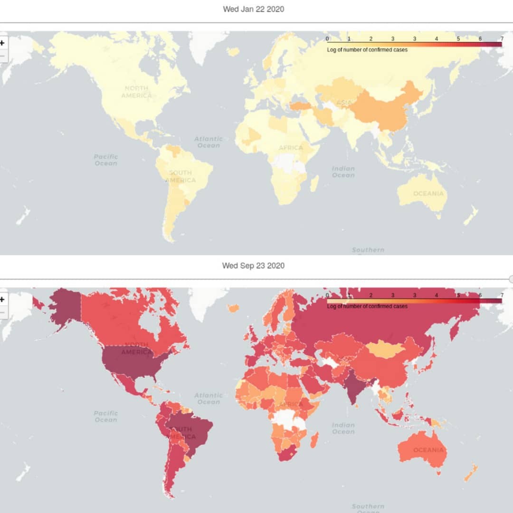

# Mapping the Spread of Covid-19 with Python
## Interactive Choropleth Map Dashboard

## data source:

## Visualizations

### How to run it on docker
1. Launch Docker:
`systemctl start docker` (if you run Kali linux)

1.1. Test docker is well installed:
`docker run hello-world`

2. Create a Docker image, Build it and run a container from it
docker build website (with option to tag it with the file name and send all the website's content):
`docker build --tag website .`

3. For the first time, run & publish docker image (website) file (on port 80 by default):
`docker run --publish 80:80 website`

4. Moving forward, to expose the docker image via command up (down being to remove the image files that are up):
`docker-compose up -d website` ||
`docker-compose up`

